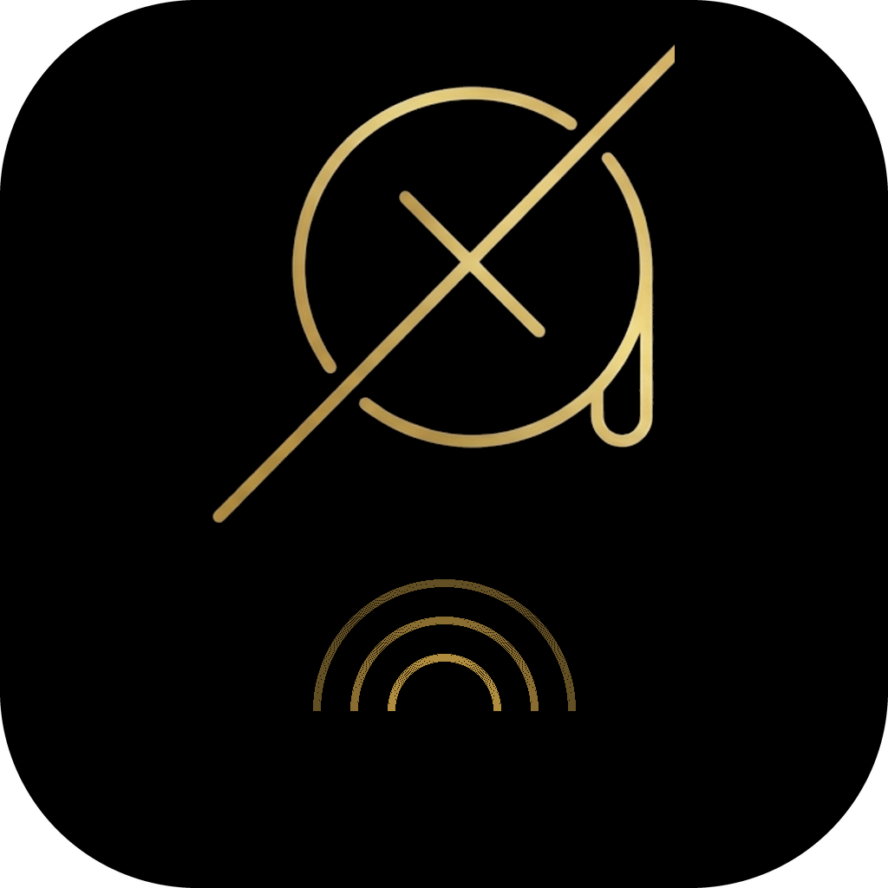

<p align="center">
  
</p>

<h1 align="center">AFlow</h1>

<p align="center">
  <strong>Voz a texto para macOS. Alternativa gratuita a Wispr Flow.</strong>
</p>

<p align="center">
  
  
  
  
  
</p>

---

## ¿Qué es AFlow?

AFlow es una herramienta de **dictado por voz para macOS**. Presiona un atajo, habla, suelta — tu texto aparece donde tengas el cursor. Funciona en cualquier app.

Reemplaza a [Wispr Flow](https://wispr.com) ($15/mes). AFlow usa la [API Whisper de Groq](https://console.groq.com/docs/speech-to-text) a **~$0.02/hora** — aproximadamente **$0.60/mes** con uso intensivo diario.

---

## Características

- **App nativa de macOS** — vive en la barra de menú, sin terminal, arranca con tu Mac
- **Dictado en cualquier app** — VS Code, Chrome, Slack, Notes, lo que sea
- **Dos modos de grabación** — manten Ctrl+Option (push-to-talk) o doble toque Ctrl (manos libres)
- **Pill flotante** — overlay minimalista con barras de audio en tiempo real
- **Sin robar foco** — la pill flota sin interrumpir tu trabajo (APIs nativas de macOS)
- **Auto-paste** — el texto aparece exactamente donde estaba tu cursor
- **Dashboard web** — historial, búsqueda y copia en `localhost:5678`
- **SQLite local** — cada transcripción guardada con timestamp y duración
- **Multilenguaje** — español, inglés, francés y todos los idiomas que soporta Whisper
- **Setup en primer lanzamiento** — te pide la API key al abrir por primera vez

---

## Instalación rápida

### Requisitos

- macOS 15+
- Python 3.12+
- [Homebrew](https://brew.sh)
- [Groq API key](https://console.groq.com/keys) (tiene tier gratuito)

### Opción 1 — App de escritorio (recomendado)

```bash
git clone https://github.com/eudomar3004/AFlow.git
cd AFlow

brew install portaudio

python3 -m venv venv
source venv/bin/activate
pip install -r requirements.txt

bash build.sh

# IMPORTANTE: usar ditto, no cp -r
ditto dist/AFlow.app /Applications/AFlow.app
xattr -cr /Applications/AFlow.app
```

Abre AFlow desde Spotlight. Al primer lanzamiento te pedirá tu [Groq API key](https://console.groq.com/keys).

### Opción 2 — Modo desarrollo

```bash
git clone https://github.com/eudomar3004/AFlow.git
cd AFlow

brew install portaudio

python3 -m venv venv
source venv/bin/activate
pip install -r requirements.txt

cp .env.example .env
# Edita .env y agrega tu GROQ_API_KEY

python3 main.py
```

---

## Permisos de macOS requeridos

| Permiso | Cómo darlo |
|---------|------------|
| **Accesibilidad** | Config. del Sistema → Privacidad → Accesibilidad → agregar Terminal/IDE |
| **Micrófono** | Se solicita automáticamente al primer uso |

---

## Cómo usar

| Acción | Resultado |
|--------|-----------|
| Mantén **Ctrl+Option** | Graba mientras mantienes presionado |
| **Doble toque Ctrl** | Inicia grabación manos libres |
| **Ctrl** (durante manos libres) | Detiene la grabación |
| Abre `localhost:5678` | Dashboard con historial |

---

## Estructura del proyecto

```
aflow/
├── main.py                 # Punto de entrada — tray, setup, controlador principal
├── config.py               # Constantes de configuración (UI, audio, rutas)
├── core/
│   ├── recorder.py         # Captura de audio con sounddevice
│   ├── transcriber.py      # Cliente Groq Whisper API
│   ├── hotkey.py           # Hotkeys globales (Ctrl+Option y doble Ctrl)
│   └── clipboard.py        # Guardar foco + paste nativo por AppleScript
├── db/
│   └── database.py         # CRUD SQLite
├── ui/
│   ├── pill_widget.py      # Overlay flotante (macOS nativo vía PyObjC)
│   └── audio_visualizer.py # Barras de audio en tiempo real
├── web/
│   └── server.py           # Dashboard Flask en localhost:5678
├── requirements.txt
├── .env.example
└── build.sh
```

---

## Costo estimado

| Uso | Costo mensual estimado |
|-----|----------------------|
| 1 hora/día | ~$0.60 |
| 2 horas/día | ~$1.20 |
| Uso intensivo (4h/día) | ~$2.40 |

vs. Wispr Flow: **$15/mes fijos**

---

## Licencia

MIT License — úsalo, modifícalo, compártelo libremente.
